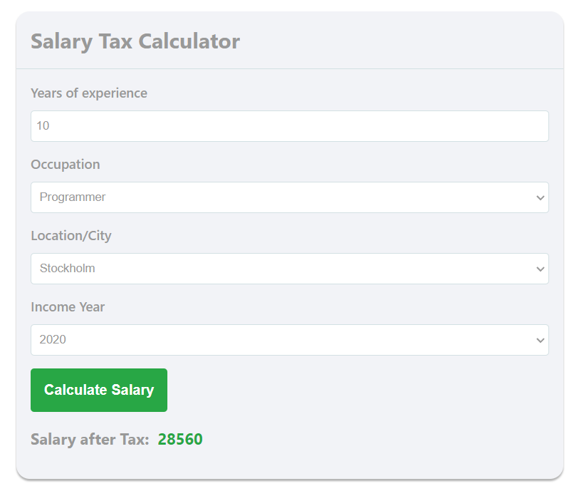
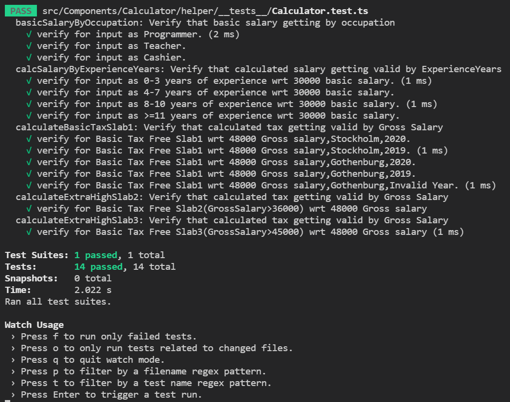

## Salary Tax Calculator

Salary Tax Calculator can calculate the NET Salary according to Europe Tax Rules, It is built using React , JavaScript and SASS for styling.

## Demo ScreenShot

## Installation and Setup Instructions

Install Node Js on your machine.

Install Pre-req Packages:

`npm install`

To Start App Server:

`npm start`

To Visit App Via Browser:

`localhost:3000`

To Run All Test Cases:

`npm run test`
